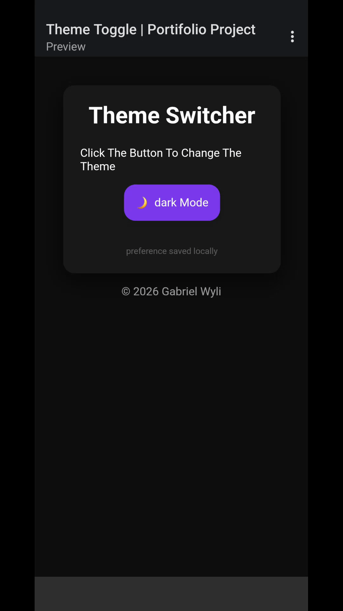

# Theme Switcher (Dark & Light Mode)

## Preview

A clean and minimal **Dark / Light Mode toggle** built with **HTML, CSS and Vanilla JavaScript**.  
This project focuses on UI state management, CSS variables, and smooth user experience transitions.

---

## 🚀 Features

- 🌙 Dark Mode & ☀️ Light Mode toggle
- 🎨 Theme handled using **CSS Variables**
- 💾 User preference feedback (locally simulated)
- ✨ Smooth transitions for background, card and text
- 🧠 Clear separation of structure, style and logic
- 📱 Responsive and centered layout

---

## 🛠️ Technologies Used

- **HTML5** – semantic structure  
- **CSS3**
  - CSS Variables (`:root`)
  - Flexbox layout
  - Box-shadows & neumorphism-inspired UI
  - Transitions and hover effects
- **Vanilla JavaScript**
  - DOM manipulation
  - Class toggling
  - Dynamic text & icon updates
  - Timed UI feedback (`setTimeout`)

---

## 🧩 How It Works

1. The button toggles the `light-theme` class on `<body>`
2. CSS variables update colors, background and shadows automatically
3. JavaScript checks the current theme state
4. Icon.

## 📬 Contact

If you’d like to work together, have questions, or want to give feedback, feel free to reach out:

- **Name:** Gabriel Wyli  
- **Email:** gabrielwyli54@gmail.com  

I’m open to freelance opportunities, small frontend projects, and collaborations.
